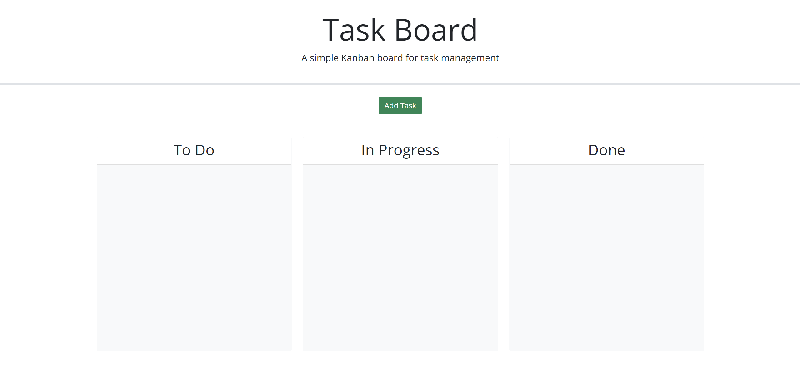

# Task-Board

## Description
A task board to help schedule and organize tasks with due dates that are past due, in progress, or due in the future.

## Installation
N/A

## Usage
Input different tasks with a title, description, and due date. Organize each inputted task by dragging and dropping the task. Each category is labeled as; "To Do" for tasks that need to be done, "In Progress" for tasks that are still in progress but aren't finished, and "Done" for tasks that have been completed. Below each task is a "Delete" button which can be used to remove any unwanted tasks from the task board.

Currently there is an issue: upon dragging and dropping tasks into the other categories the tasks are appearing behind the task board. After refreshing the website those tasks will appear in front of the respective categories. 

## Preview

[Click here to preview My Task Board website](https://rawnaqk.github.io/Task-Board/)

## Credits
N/A

## License
Please refer to the LICENSE in the repo.